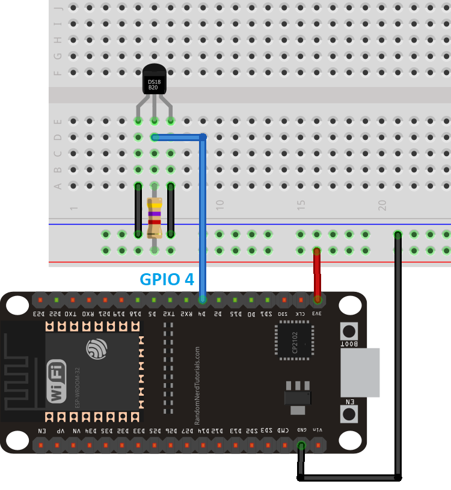
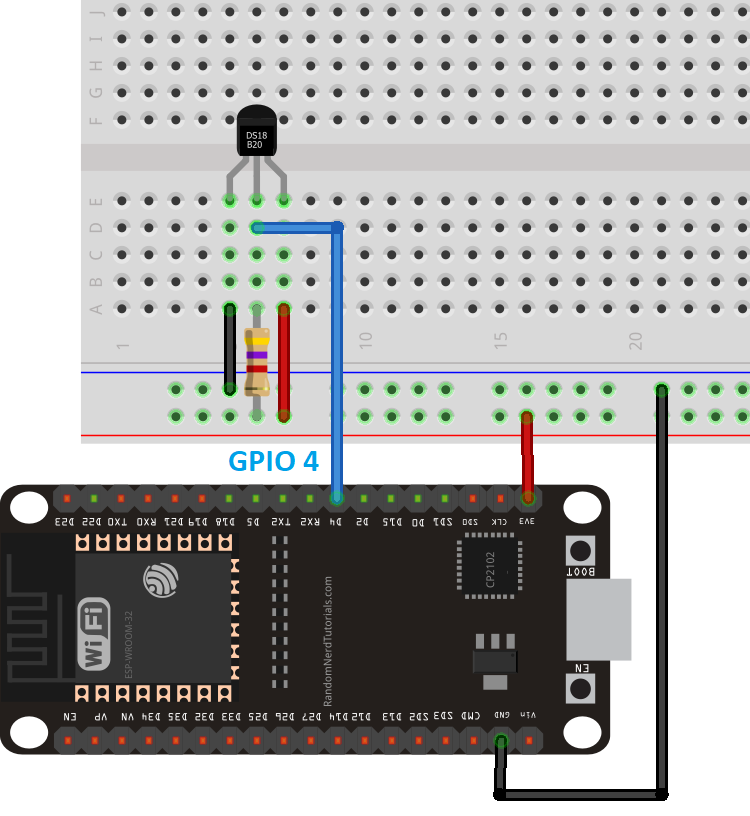
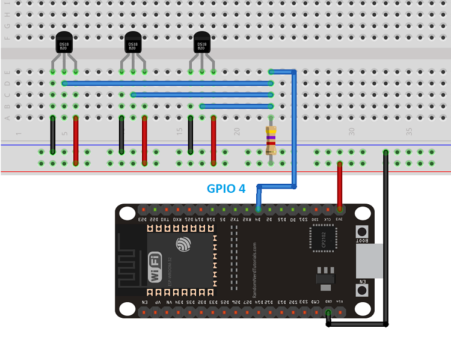
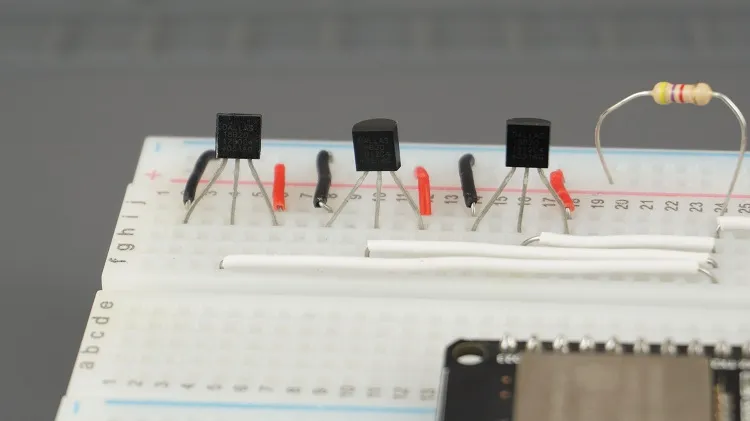

# ESP32 DS18B20 temperature
## Libraries
- [One Wire library by Paul Stoffregen](https://github.com/PaulStoffregen/OneWire "One Wire library")
- [Dallas Temperature library](https://github.com/milesburton/Arduino-Temperature-Control-Library "Dallas Temperature")

Sketch > Include Library > Manage Libraries

## Circuit
Single Parasite

Single Normal

Multiple

Multiple image

