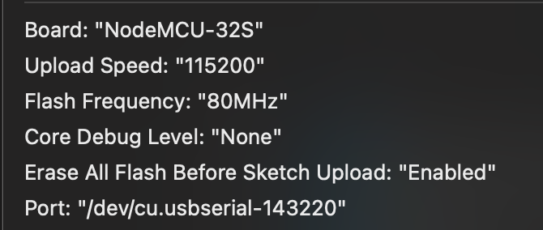
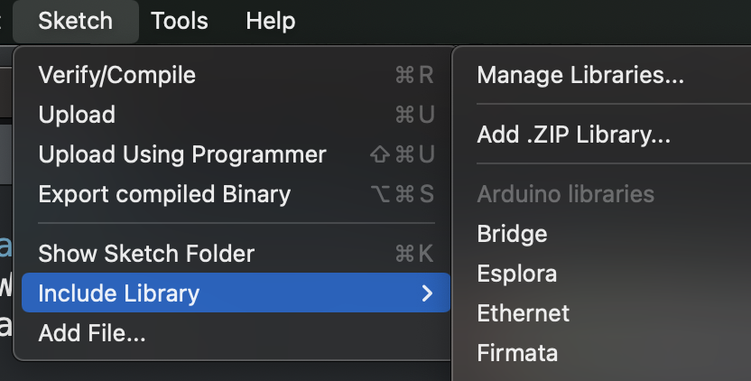

# ESP32 DS18B20 temperature

### Board

### Libraries

- [One Wire](https://github.com/PaulStoffregen/OneWire "One Wire library") library by Paul Stoffregen

  

- [Dallas Temperature](https://github.com/milesburton/Arduino-Temperature-Control-Library "Dallas Temperature")

  

- Add libraries from Sketch -> Include Library -> Add .ZIP Library
  
    + [ESPAsyncWebServer](https://github.com/me-no-dev/ESPAsyncWebServer/archive/refs/heads/master.zip "ESPAsyncWebServer") Zip file (.zip folder)
    + [AsyncTCP](https://github.com/me-no-dev/AsyncTCP/archive/refs/heads/master.zip "AsyncTCP") (.zip folder)

### Seven Segment LED Display

- Using TM1637 module to display temperature celsius.
  Choose <a href="https://github.com/AKJ7/TM1637" target="_blank">Library - TM1637 Driver</a> for ESP32
  

### SRD-05VDC-SL-C Relay

- Ref: <a href="https://diyi0t.com/relay-tutorial-for-arduino-and-esp8266/" target="_blank">SRD-05VDC-SL-C</a>
